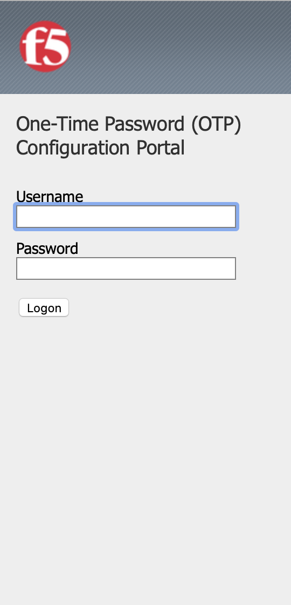
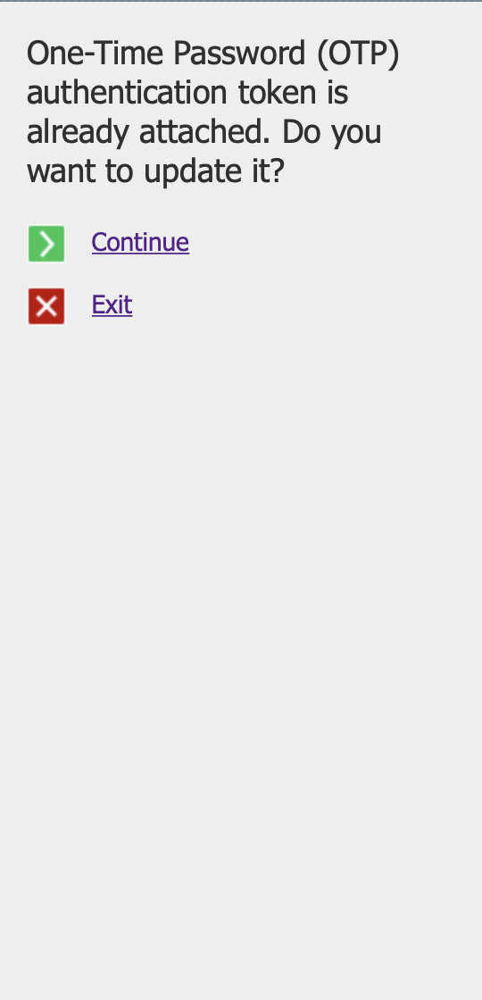

# About
F5 :: One-Time Password (OTP) application

  

## Overview

One-Time Password (OTP) application for F5 BIG-IP to be used in deployments without external Multi-Factor Authentication (MFA) servers, like RSA SecurID or OpenOTP. This application uses pure Active Directory for user authentication and shared secret value storage. All you need after the deployment of this app is to tell your users to download 1Password, Google Authenticator, Microsoft Authenticator or any other OTP-compatible application to their mobile devices and start using Two-Factor Authentication (TFA) for your services.

This implementation is based on:
* RFC 4226 - HOTP: An HMAC-Based One-Time Password Algorithm
* RFC 6238 - TOTP: Time-Based One-Time Password Algorithm

## Screenshots

 

## Installation

Please take a look at the [documentation](docs/INSTALL.md) for instructions on installing OTP application on BIG-IP

## Integration

See [APM integration](docs/INT_APM.md) for instructions on integration OTP verify with virtual servers that do support iRule Event
See [LTM integration](docs/INT_LTM.md) for instructions on integration OTP verify with virtual servers that do not support iRule Event
