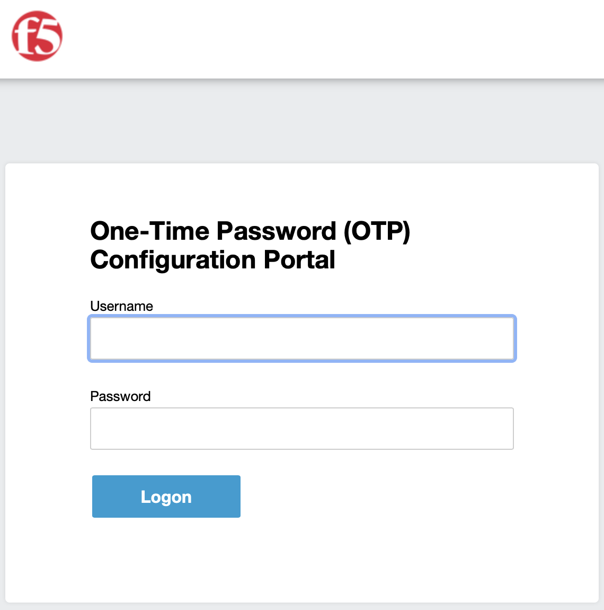
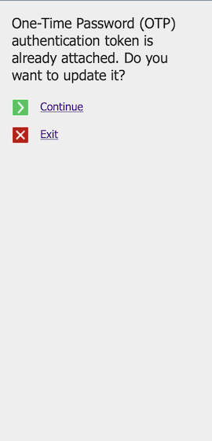

# F5 :: One-Time Password (OTP) application

    

## Overview

One-Time Password (OTP) application for F5 BIG-IP to be used in deployments **without** external Multi-Factor Authentication (MFA) servers, like paid products from well-known vendors. This application uses pure Active Directory for user authentication and shared secret value storage. All you need after the deployment of this app is to tell your users to download *AgileBits 1Password*, *Google Authenticator*, *Microsoft Authenticator* or any other OTP-compatible application to their mobile devices and start using Two-Factor Authentication (MFA) for your services.

This solution is based on:
* RFC 4226 - HOTP: An HMAC-Based One-Time Password Algorithm
* RFC 6238 - TOTP: Time-Based One-Time Password Algorithm

## The Story

123

### Screenshots

 

## Requirements

Required systems for this application:
* BIG-IP LTM + APM + iRulesLX (*)
* Active Directory
* SMTP server
* OTP-compatible generator

\* - tested on version 14.x

## Installation

Take a look at the [Installation Guide](docs/INSTALL.md) for instructions on installing OTP application on your BIG-IP. This guide is need to be used to establish base configuration on BIG-IP which allow you to start creating and modifying tokens. To use this application for OTP verification in BIG-IP deployed or external applications please see Implementation chapter below.

## Implementation

See [Implementation Guide](docs/IMPLEMENT.md) for instructions on how to integrate OTP verify with APM-enabled virtual servers with **iRule Event** support. In this document you will also find instructions on how to integrate OTP verify with APM-enabled virtual servers without **iRule Event** support or external applications that are able to sned and receive HTTP validation requests.

## Troubleshooting

To understand how to debug installed application in your environment take a look at the [Troubleshooting Guide](docs/TSHOOT.md) for instructions on enabling debug log messages and decoding them correctly.

## Architecture

If you would like to know more about this application please take a look at the [Architecture Description](docs/ARCH.md) for detailed solution description with all caveats and drawbacks. This document contains schemes and explanation of various aspects of this solution. After reading this document you will be able change and adapt this application to your environment.
