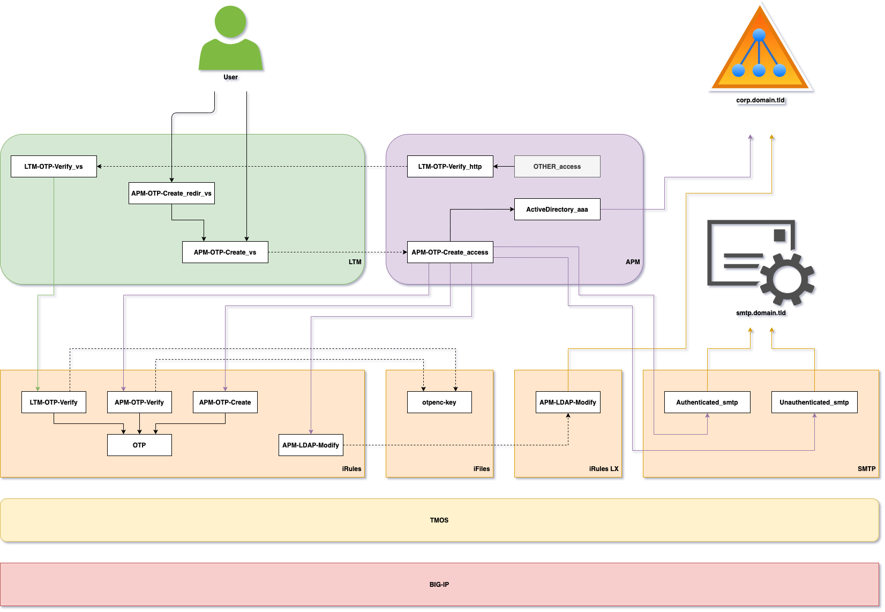

# Architecture Description

## Contents

- [Overview](#overview)
- [Used BIG-IP subsystems](#used-big-ip-subsystems)
- [iRules description](#irules-description)
  - [OTP](#otp)
  - [APM-OTP-Create_irule](#apm-otp-create_irule)
  - [APM-OTP-Verify_irule](#apm-otp-verify_irule)
  - [LTM-OTP-Verify_irule](#ltm-otp-verify_irule)
- [iRules LX description](#irules-lx-description)
  - [APM-LDAP-Modify_irule](#apm-ldap-modify_irule)
  - [APM-LDAP-Modify_ilx](#apm-ldap-modify_ilx)
- [Notes](#notes)
- [Caveats](#caveats)

---

## Overview

This application as the example of a co-operation of several BIG-IP subsystems which allows to build secure business-specific modern solution without additional costs. You need to know how to write and modify iRules (synchronous TCL) and iRules LX (asynchronous NodeJS), how to create APM policies with known limitations - where to use APM **iRule Event** and where to use APM **HTTP Auth**. You also have to understand, how to create AES encryption key to be used for shared secret value encryption.



## Used BIG-IP subsystems

* TMOS subsystem (iFiles and SMTP objects)
* LTM subsystem (virtual servers, iRules and iRules LX)
* APM subsystem (access policies and AAA objects)

## iRules description

iRules used as a main component in OTP creation and verification process. They are also used to generate proper QR code for user OTP generator. Encoding and decoding of a shared secret value is a task that is accomplished by iRules too. Shared secret value generated by iRule must be safely kept in storage from where it may be derived later.

### OTP

This iRule is a library for One-Time Password (OTP) handlers. It implements public standards described in "RFC 4226 - HMAC-Based One-Time Password (HOTP) algorithm" and "RFC 6238 - TOTP: Time-Based One-Time Password Algorithm". It supports Google Authenticator (GA) shared key length equal to 80 bits also.

**Procedure list**  
```tcl
proc create_secret {algo} { }
proc create_hotp {algo secret digit counter} { }
proc verify_hotp {algo secret digit otp counter} { }
proc verify_totp {algo secret digit otp step_size step_num} { }
proc check_bruteforce {user period attempt delay} { }
proc check_replay {user period otp} { }
proc check_input {var_array flag_debug} { }
```

More about implemented input variables and output data type you can find in [OTP.tcl](../irules/OTP.tcl) file. This file was built to be a library located in **Common** partition and to be used in other iRules as a backend function storage. Future updates to Request For Comments files (HOTP, TOTP or something new) may be applied to this library easily without modification of upper layer components. This library does not have any debug switches. All errors will be delivered to **local0.error** automatically.

### APM-OTP-Create_irule

This iRule is used in APM enabled virtual servers with support of event **ACCESS_POLICY_AGENT_EVENT**. It allows the creation of shared secret value for purpose of usage for One-Time Password (OTP) enabled applications. After successfull creation of shared secret value user has a choice to use cleartext value or encrypted one. Cleartext value is stored in secured APM session variable. This iRule depends on **/Common/OTP** library.

**Variables list**  
```tcl
set otp(secret_keyfile) [ACCESS::session data get "session.custom.otp.secret_keyfile"]
set otp(secret_hmac) [ACCESS::session data get "session.custom.otp.secret_hmac"]
set otp(otp_numdig) [ACCESS::session data get "session.custom.otp.otp_numdig"]
set otp(timestep_value) [ACCESS::session data get "session.custom.otp.timestep_value"]
set otp(user_mail) [ACCESS::session data get "session.custom.otp.user_mail"]
```

More about implemented input variables and output data type you can find in [APM-OTP-Create.tcl](../irules/APM-OTP-Create.tcl) file. File contains debug switch `set static::otp_create_debug` which allows you to check input variables using `/var/log/ltm` file. All errors will be delivered to **local0.error** automatically.

When you update encryption key that will be used for shared secret value encryption there is a probability that your text editor will add empty line in the end of this file. Below part of code is used to strip this line down:
```tcl
set secret_key [string trim [ifile get $secret_keyfile]]
```

### APM-OTP-Verify_irule

This iRule is used in APM enabled virtual servers with support of event **ACCESS_POLICY_AGENT_EVENT**. If this event is not supported for some reasons or limitations please use **LTM-OTP-Verify_irule** attached virtual server. This iRule retrieves session variables from APM and checks user entered OTP value for correctness. This iRule depends on **/Common/OTP** library.

**Variables list**  
```tcl
set otp(secret_value) [ACCESS::session data get "session.custom.otp.secret_value"]
set otp(secret_keyfile) [ACCESS::session data get "session.custom.otp.secret_keyfile"]
set otp(secret_hmac) [ACCESS::session data get "session.custom.otp.secret_hmac"]
set otp(otp_value) [ACCESS::session data get "session.custom.otp.otp_value"]
set otp(otp_numdig) [ACCESS::session data get "session.custom.otp.otp_numdig"]
set otp(timestep_value) [ACCESS::session data get "session.custom.otp.timestep_value"]
set otp(timestep_num) [ACCESS::session data get "session.custom.otp.timestep_num"]
set otp(aaa_name) [ACCESS::session data get "session.custom.otp.aaa_name"]
set otp(user_name) [ACCESS::session data get "session.custom.otp.user_name"]
set otp(security_attempt) [ACCESS::session data get "session.custom.otp.security_attempt"]
set otp(security_period) [ACCESS::session data get "session.custom.otp.security_period"]
set otp(security_delay) [ACCESS::session data get "session.custom.otp.security_delay"]
```

More about implemented input variables and output data type you can find in [APM-OTP-Verify.tcl](../irules/APM-OTP-Verify.tcl) file. File contains debug switch `set static::otp_verify_apm_debug` which allows you to check input variables using `/var/log/ltm` file. All errors will be delivered to **local0.error** automatically.

When you update encryption key that will be used for shared secret value encryption there is a probability that your text editor will add empty line in the end of this file. Below part of code is used to strip this line down:
```tcl
set secret_key [string trim [ifile get $secret_keyfile]]
```

After OTP value validation this iRules checks for replay and brute force attacks as described in [RFC 4226](https://tools.ietf.org/html/rfc4226) - HOTP: An HMAC-Based One-Time Password Algorithm.

### LTM-OTP-Verify_irule

This iRule is used in LTM enabled virtual servers used to verify One-Time Password. This iRule depends on **/Common/OTP** library

**Variables list**  
```tcl
set otp(secret_value) [URI::decode [URI::query [HTTP::uri] secret_value]]
set otp(secret_keyfile) [URI::decode [URI::query [HTTP::uri] secret_keyfile]]
set otp(secret_hmac) [URI::decode [URI::query [HTTP::uri] secret_hmac]]
set otp(otp_value) [URI::decode [URI::query [HTTP::uri] otp_value]]
set otp(otp_numdig) [URI::decode [URI::query [HTTP::uri] otp_numdig]]
set otp(timestep_value) [URI::decode [URI::query [HTTP::uri] timestep_value]]
set otp(timestep_num) [URI::decode [URI::query [HTTP::uri] timestep_num]]
set otp(aaa_name) [URI::decode [URI::query [HTTP::uri] aaa_name]]
set otp(user_name) [URI::decode [URI::query [HTTP::uri] user_name]]
set otp(security_attempt) [URI::decode [URI::query [HTTP::uri] security_attempt]]
set otp(security_period) [URI::decode [URI::query [HTTP::uri] security_period]]
set otp(security_delay) [URI::decode [URI::query [HTTP::uri] security_delay]]
```

More about implemented input variables and output data type you can find in [LTM-OTP-Verify.tcl](../irules/LTM-OTP-Verify.tcl) file. File contains debug switch `set static::otp_verify_ltm_debug` which allows you to check input variables using `/var/log/ltm` file. All errors will be delivered to **local0.error** automatically.

When you update encryption key that will be used for shared secret value encryption there is a probability that your text editor will add empty line in the end of this file. Below part of code is used to strip this line down:
```tcl
set secret_key [string trim [ifile get $secret_keyfile]]
```

After OTP value validation this iRules checks for replay and brute force attacks as descripbed in [RFC 4226](https://tools.ietf.org/html/rfc4226) - HOTP: An HMAC-Based One-Time Password Algorithm.

## iRules LX description

iRules LX used as a main component in shared secret value storage process. They are used to deliver new shared secret value to Active Directory to user account attribute **extensionAttribute2** with help of LDAP protocol. Under the hood iRules LX's NodeJS code executes NPM package *ldapjs* to do this work.

### APM-LDAP-Modify_irule

This iRule is wrapper for iRule LX that updates selected LDAP attribute with new value. This iRule depends on **/Common/OTP** library

**Variables list**  
```tcl
set ldap(bind_scheme) [ACCESS::session data get "session.custom.ldap.bind_scheme"]
set ldap(bind_fqdn) [ACCESS::session data get "session.custom.ldap.bind_fqdn"]
set ldap(bind_port) [ACCESS::session data get "session.custom.ldap.bind_port"]
set ldap(bind_dn) [ACCESS::session data get "session.custom.ldap.bind_dn"]
set ldap(bind_pwd) [ACCESS::session data get -secure "session.custom.ldap.bind_pwd"]
set ldap(user_dn) [ACCESS::session data get "session.custom.ldap.user_dn"]
set ldap(user_attr) [ACCESS::session data get "session.custom.ldap.user_attr"]
set ldap(user_value) [ACCESS::session data get "session.custom.ldap.user_value"]
```

More about implemented input variables and output data type you can find in [APM-LDAP-Modify.tcl](../iruleslx/APM-LDAP-Modify.tcl) file. File contains debug switch `set static::ldap_modify_debug` which allows you to check input variables using `/var/log/ltm` file. All errors will be delivered to **local0.error** automatically.

### APM-LDAP-Modify_ilx

This iRule LX receives LDAP bind data and LDAP modify data from classic iRule. After successful LDAPS connection it modifies selected LDAP attribute with new value. This iRule LX assumes that LDAP URL will use **ldaps://** scheme and **636** port. Bind operation has special parameter **rejectUnauthorized=false** to allow connection to untrusted SSL servers. This iRule LX assumes that selected LDAP attribute is already present on LDAP user. Otherwise modify operation will fail

```js
const ldapBindScheme = req.params()[0];
const ldapBindFqdn = req.params()[1];
const ldapBindPort = req.params()[2];
const ldapBindDn = req.params()[3];
const ldapBindPwd = req.params()[4];
const ldapUserDn = req.params()[5];
const ldapUserAttr = req.params()[6];
const ldapUserSecret = req.params()[7];
```

More about implemented input variables and output data type you can find in [APM-LDAP-Modify.js](../iruleslx/APM-LDAP-Modify.js) file. File contains debug switch `const ldap_modify_debug` which allows you to check debug messages using `/var/log/ltm` file. All errors will be delivered to `/var/log/ltm` file automatically.

This script uses **Promises** to emulate synchronous code execution in async NodeJS environmet. It also uses *dns* NPM package to resolve Active Directory FQDN to a set of server IP addresses. It also uses *ldapjs* NPM package to modify Active Directory attribute over LDAP protocol.

Before debugging strange NodeJS errors on BIG-IP you can try to use [test_ldap.js](../test/test_ldap.js) file in your local NodeJS environment to check if all external systems requirements are met.

## Notes

* Application does not support token removal. You have to clear Active Directory attribute manually
* Time for BIG-IP and OTP generator must be synchronized
* Trusted devices are not implemented

## Caveats

* Using ldaps:// scheme over 636 port leads to strange ldapjs errors
* Using something other that SHA1 leads to errors
