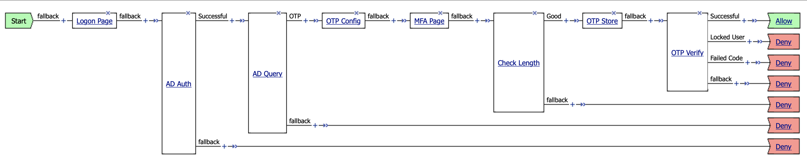
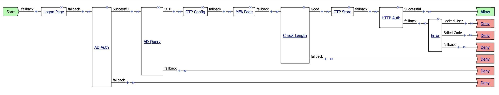

# Implementation Guide

This guide will help you to configure appropriate type of One-Time Password (OTP) verification process that is valid for your environment. First option is to use iRule with name **APM-OTP-Verify_irule** and virtual server that do support APM **iRule Event**. This is the most commonly deployed model because it does not use external HTTP connections from APM to LTM virtual server. Second option is to use APM **HTTP Auth** with name **LTM-OTP-Verify_http** and virtual server that do not support APM **iRule Event**. This option must be used for special deployments like VMware Horizon Client.

---

## Contents

1. Using **APM-OTP-Verify_irule** for virtual servers that do support APM **iRule Event** (OTP-APM)
2. Using **LTM-OTP-Verify_http** for virtual servers that do not support APM **iRule Event** (OTP-LTM)

## Setup OTP-APM

This is an example policy shows how to use APM **iRule Event** with iRule **APM-OTP-Verify_irule** to add Multi-Factor Authentication (MFA) to deployed on BIG-IP applications.

**Endings**  
Name = `Deny`  
Type = Deny [default]  
Color = #2  
Name = `Allow`  
Type = Allow  
Color = #1  

**Logon Page**  
Type = Logon Page  

**AD Auth**  
Type = AD Auth  
Server = **/CONTOSO/ActiveDirectory_aaa**  

**AD Query**  
Type = AD Query  
Server = **/CONTOSO/ActiveDirectory_aaa**  
SearchFilter = `sAMAccountName=%{session.logon.last.username}`  
Required Attributes: **dn**, **extensionAttribute2**, **mail**, **memberOf**, **sAMAccountName**  
OTP = `expr {[mcget {session.ad.last.attr.extensionAttribute2}] != ""}`  

You can customise **fallback** branch of this element and show descriptive error message for user. Like "You do not have an OTP token attached" or something else.

**OTP Config**  
Type = Variable Assign  
`session.custom.otp.secret_value` = AAA extensionAttribute2  
`session.custom.otp.secret_keyfile` = `return {/CONTOSO/otpenc-key}`  
`session.custom.otp.secret_hmac` = `return {sha1}`  
`session.custom.otp.otp_numdig` = `return {6}`  
`session.custom.otp.timestep_value` = `return {30}`  
`session.custom.otp.timestep_num` = `return {1}`  
`session.custom.otp.user_name` = AAA sAMAccountName  
`session.custom.otp.user_mail` = AAA mail  
`session.custom.otp.security_attempt` = `return {3}`  
`session.custom.otp.security_period` = `return {60}`  
`session.custom.otp.security_delay` = `return {300}`  

**MFA Logon**  
Type = Logon Page  
Variable Type = text; Post Variable Name = `otp_value`; Session Variable Name = `otp_value`  
Variable Type = **none**; Post Variable Name = password; Session Variable Name = password  
Logon Page Input Field #1 = `One-Time Password`  
Logon Button = `Submit`  

**Check Length**  
Type = Empty  
`Good` = `expr {[string length [mcget {session.logon.last.otp_value}]] == [mcget {session.custom.otp.otp_numdig}]}`  

You can customise **fallback** branch of this element and show descriptive error message for user. Like "OTP length must be exactly X symbols" or something else.

**OTP Store**  
Type = Variable Assign  
`session.custom.otp.otp_value` = SESSION session.logon.last.otp_value  

**OTP Verify**  
Type = iRule Event  
ID = `otp_verify`  
`Successful` = `expr {[mcget -nocache {session.custom.otp.verify_result}] == 0}`  
`Locked User` = `expr {[mcget -nocache {session.custom.otp.verify_result}] == 2}`  
`Failed Code` = `expr {[mcget -nocache {session.custom.otp.verify_result}] == 3}`  

It is better to add some error description that will be visioble to user for all branches except **Successful**. So user could understand wether he or she entered wrong code or there were too many failed attempts and user was locked out.

## Setup OTP-LTM

This is an example policy shows how to use APM **HTTP Auth** with iRule **LTM-OTP-Verify_irule** to add Multi-Factor Authentication (MFA) to deployed on BIG-IP applications that do not support APM **iRule Event**.

**Endings**  
Name = `Deny`  
Type = Deny [default]  
Color = #2  
Name = `Allow`  
Type = Allow  
Color = #1  

**Logon Page**  
Type = Logon Page  

**AD Auth**  
Type = AD Auth  
Server = **/CONTOSO/ActiveDirectory_aaa**  

**AD Query**  
Type = AD Query  
Server = **/CONTOSO/ActiveDirectory_aaa**  
SearchFilter = `sAMAccountName=%{session.logon.last.username}`  
Required Attributes: **dn**, **extensionAttribute2**, **mail**, **memberOf**, **sAMAccountName**  
OTP = `expr {[mcget {session.ad.last.attr.extensionAttribute2}] != ""}`  

You can customise **fallback** branch of this element and show descriptive error message for user. Like "You do not have an OTP token attached" or something else.

**OTP Config**  
Type = Variable Assign  
`session.custom.otp.secret_value` = AAA extensionAttribute2  
`session.custom.otp.secret_keyfile` = `return {/CONTOSO/otpenc-key}`  
`session.custom.otp.secret_hmac` = `return {sha1}`  
`session.custom.otp.otp_numdig` = `return {6}`  
`session.custom.otp.timestep_value` = `return {30}`  
`session.custom.otp.timestep_num` = `return {1}`  
`session.custom.otp.user_name` = AAA sAMAccountName  
`session.custom.otp.user_mail` = AAA mail  
`session.custom.otp.security_attempt` = `return {3}`  
`session.custom.otp.security_period` = `return {60}`  
`session.custom.otp.security_delay` = `return {300}`  

**MFA Logon**  
Type = Logon Page  
Variable Type = text; Post Variable Name = `otp_value`; Session Variable Name = `otp_value`  
Variable Type = **none**; Post Variable Name = password; Session Variable Name = password  
Logon Page Input Field #1 = `One-Time Password`  
Logon Button = `Submit`  

**Check Length**  
Type = Empty  
`Good` = `expr {[string length [mcget {session.logon.last.otp_value}]] == [mcget {session.custom.otp.otp_numdig}]}`  

You can customise **fallback** branch of this element and show descriptive error message for user. Like "OTP length must be exactly X symbols" or something else.

**OTP Store**  
Type = Variable Assign  
`session.custom.otp.otp_value` = SESSION session.logon.last.otp_value  

**HTTP Auth**  
Type = HTTP Auth
AAA Server = **/Common/LTM-OTP-Verify_http**  

**Error**  
Type = Empty  
`Locked User` = `expr {[string match "*X-Error-Code: 2*" [mcget {session.http.last.response_header.0}]] == 1}`  
`Failed Code` = `expr {[string match "*X-Error-Code: 3*" [mcget {session.http.last.response_header.0}]] == 1}`  

It is better to add some error description that will be visioble to user for all branches. So user could understand wether he or she entered wrong code or there were too many failed attempts and user was locked out.
