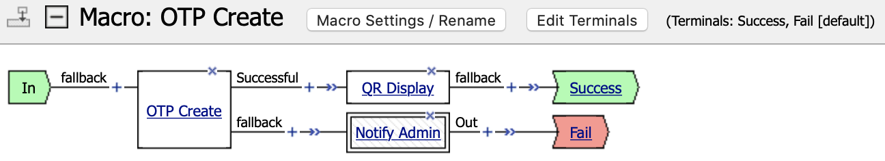

# Installation Guide

## Contents

- [Overview](#overview)
- [Create external objects](#create-external-objects)
- [Create BIG-IP iRules](#create-big-ip-irules)
- [Create BIG-IP iRules LX](#create-big-ip-irules-lx)
- [Create TMOS SMTP objects](#create-tmos-smtp-objects)
- [Create APM Active Directory AAA object](#create-apm-active-directory-aaa-object)
- [Create APM policy](#create-apm-policy)
- [Create APM hosted content](#create-apm-hosted-content)
- [Apply APM customization (standard)](#apply-apm-customization-standard)
- [Apply APM customization (modern)](#apply-apm-customization-modern)
- [Create OTP-APM virtual server](#create-otp-apm-virtual-server)
- [Create APM HTTP AAA object](#create-apm-http-aaa-object)
- [Create OTP-LTM virtual server](#create-otp-ltm-virtual-server)
- [Upload encryption key](#upload-encryption-key)

---

## Overview

This manual will guide you through the OTP application installation process on F5 BIG-IP. You need to have LTM, APM and iRulesLX provisioned modules on your BIG-IP. It is better to have AFM provisioned module to be able to defend from various attacks. You also need to have Active Directory and SMTP server.

OTP application consists of:
* OTP-APM virtual server used as OTP configuration portal. Portal is used for creation and modification of assigned OTP token
* OTP Verify iRule used for BIG-IP applications that do support APM **iRule Event**
* OTP-LTM virtual server used for BIG-IP applications that do not support APM **iRule Event** (like VMware Horizon Client)

## Create external objects

1. BIG-IP partition. Select tenant that will be used to deploy OTP application. Standard impementation uses scheme *Active Directory domain = BIG-IP partition*
2. BIG-IP client SSL profile. Select a client SSL profile with Perfect Forward Secrecy (PFS) configured
3. IP address for OTP-APM virtual server. This address will be used for an OTP configuration portal
4. IP address for OTP-LTM virtual server. This address will be used for applications that do not support APM **iRule Event**
5. IP addresses of DNS servers that are able to resolve LDAP fully qualified domain name
6. LDAP scheme. Valid values are **ldap://** or **ldaps://**. First is recommended for usage because second leads to strange errors which are sourced from *ldapjs* NPM package
7. LDAP fully qualified domain name. DNS domain name or host name if you use single LDAP server. For example, if you have Active Directory with **corp.contoso.com** DNS domain name which resolves to more than one Active Directory Domain Controller, it will be the best available option (from the High-Availability perspective). iRule LX will resolve FQDN to all available server names and try each one in case previous failed
8. LDAP port. Valid values are **389** or **636**. First is recommended for usage because second leads to strange errors which are sourced from *ldapjs* NPM package
9. LDAP user distinguished name. Distinguished name of Active Directory user with permissions to modify attribute selected to store encrypted OTP secret value
10. LDAP user password. Password for Active Directory user
11. LDAP attribure. Name of the Active Directory attribure to store encrypted OTP secret value. Standard implementation uses attribute name **extensionAttribute2**, but you are free to choose another one. Selected attribute must be available for read/write operations for LDAP user
12. LDAP group distinguished name. Distinguished name of Active Directory group that will allow access to OTP configuration portal. Standard implementation uses **Fetch Nested Groups** AD Query option, so this group may be nested in Active Directory
13. SMTP server host name. FQDN of SMTP server that is able to deliver email to BIG-IP administrators and users. Server must support authenticated and nonauthenticated connections. Authenticated connection is used to deliver messages to BIG-IP administrators and unauthenticated connection is used to deliver noreply messages to regular users
14. SMTP user. Username for authenticated SMTP connection
15. SMTP password. Password for authenticated SMTP connection
16. SMTP address for BIG-IP administrators. Email address of BIG-IP administrators that will receive **Internal Error** messages
17. SMTP address for noreply. Email address that is not available for reply, this address will be used for mesasges delivered to users
18. LDAP administrator login. SamAccountName of the Active Directory administrator to be used for Active Directory AAA object. This account must be a member of **CONTOSO\Domain Admins** group to fetch Active Directory password policies to support password-related functionality
19. LDAP administrator password. Password for Active Directory administrator

Example list of external objects:
* CONTOSO
* /CONTOSO/PFS_clientssl
* 192.0.2.1 (for otp.contoso.com)
* 192.0.2.2 (for ltm-otp.contoso.com)
* 198.51.100.10 and 198.51.100.11
* ldap://
* corp.contoso.com (resolves to 198.51.100.10 and 198.51.100.11)
* 389
* CN=bigip2faldapuser,OU=Service Accounts,DC=corp,DC=contoso,DC=com
* COMPLEX_2FA_PASSWORD_STRING
* extensionAttribute2
* CN=OTP_Allow,OU=Service Groups,DC=corp,DC=contoso,DC=com
* smtp.contoso.com
* bigipsmtpuser@contoso.com
* COMPLEX_SMTP_PASSWORD_STRING
* bigipadmins@contoso.com
* noreply@contoso.com
* bigipaddsadminuser
* COMPLEX_ADDS_PASSWORD_STRING

You can safely choose another directory services, like Apache Directory Server, OpenLDAP or other software. In the core this solution uses NPM package *ldapjs* which is compatible with any directory service with LDAP enabled access. Users in you directory services catalog must have valid email addresses stored in one of the attributes because these addresses are used to deliver messages about OTP token operations.

## Create BIG-IP iRules

1. Log in to BIG-IP GUI as a user with **Administrator** privileges
2. Check that current partition is **Common**
3. Go to *Local Traffic -> iRules -> iRule List*
4. Add iRule with name **OTP** and paste contents of [OTP.tcl](../irules/OTP.tcl) file
5. Add iRule with name **APM-OTP-Create_irule** and paste contents of [APM-OTP-Create.tcl](../irules/APM-OTP-Create.tcl) file
6. Add iRule with name **APM-OTP-Trusted_irule** and paste contents of [APM-OTP-Trusted.tcl](../irules/APM-OTP-Trusted.tcl) file
7. Add iRule with name **APM-OTP-Verify_irule** and paste contents of [APM-OTP-Verify.tcl](../irules/APM-OTP-Verify.tcl) file
8. Add iRule with name **LTM-OTP-Verify_irule** and paste contents of [LTM-OTP-Verify.tcl](../irules/LTM-OTP-Verify.tcl) file

## Create BIG-IP iRules LX

1. Log in to BIG-IP GUI as a user with **Administrator** privileges
2. Check that current partition is **Common**
3. Go to *System -> Resource Provisioning* and check that **iRules Language Extensions (iRulesLX)** is licensed and provisioned. If not you have to enable it. Remember that module reprovision may disrupt traffic processing on BIG-IP
4. Go to *Local Traffic -> iRules -> LX Workspaces*
5. Add new workspace with name **LDAP-Modify_space**
6. Add iRule with name **APM-LDAP-Modify_irule** and paste contents of [APM-LDAP-Modify.tcl](../iruleslx/APM-LDAP-Modify.tcl) file
7. Add extension with name **APM-LDAP-Modify_ilx**
8. Replace contents of file **index.js** with contents of [APM-LDAP-Modify.js](../iruleslx/APM-LDAP-Modify.js) file
9. Log in to BIG-IP CLI as a user with **Administrator** privileges
10. Execute command `bash`
11. Execute command `cd /var/ilx/workspaces/Common/LDAP-Modify_space/extensions/APM-LDAP-Modify_ilx/`
12. Execute command `npm install ldapjs --no-bin-links`
13. Log in to BIG-IP GUI as a user with **Administrator** privileges
14. Check that current partition is **Common**
15. Go to *Local Traffic -> iRules -> LX Pugins*
16. Add new plugin with name **LDAP-Modify_plugin**
17. Select **ilx-extension** from **Log Publisher**. More about **ilx-extension** may be found in [Jason Rahm's article on DevCentral](https://devcentral.f5.com/s/articles/irules-lx-logger-class-31941)
18. Select **LDAP-Modify_space** from **From Workspace**

## Create TMOS SMTP objects

1. Log in to BIG-IP GUI as a user with **Administrator** privileges
2. Check that current partition is **Common**
3. Got to *System -> Configuration -> Device -> SMTP*
4. Add new SMTP object with name **CONTOSO-Authenticated_smtp**
5. Add **smtp.contoso.com** to **SMTP Server Host Name**
6. Add **BIG-IP hostname** to **Local Host Name**
7. Add **bigipsmtpuser@contoso.com** to **From Address**
8. Select **Enabled** from **Use Authentication**
9. Add **bigipsmtpuser** to **Username**
10. Add **COMPLEX_SMTP_PASSWORD_STRING** to **Password**
11. Add new SMTP object with name **CONTOSO-Unauthenticated_smtp**
12. Add **smtp.contoso.com** to **SMTP Server Host Name**
13. Add **BIGIP_HOSTNAME** to **Local Host Name**
14. Add **BIGIP_HOSTNAME@contoso.com** to **From Address**

## Create APM Active Directory AAA object

1. Log in to BIG-IP GUI as a user with **Administrator** privileges
2. Check that current partition is **Common**
3. Go to *System -> Resource Provisioning* and check that **Access Policy (APM)** is licensed and provisioned. If not you have to enable it. Remember that module reprovision may disrupt traffic processing on BIG-IP
4. Select partition **CONTOSO** to deploy a new APM policy
5. Go to *Access -> Authentication -> Active Directory*
6. Add new Active Directory server with name **ActiveDirectory_aaa**
7. Add **corp.contoso.com** to **Domain Name**
8. Add **/CONTOSO/ActiveDirectory_pool** to **Domain Controller Pool Name**
9. Add all domain controller servers to **Domain Controllers**
10. Add **bigipaddsadminuser** to **Admin Name**
11. Add **COMPLEX_ADDS_PASSWORD_STRING** to **Admin Password**
12. Add **COMPLEX_ADDS_PASSWORD_STRING** to **Verify Admin Password**

## Create APM Policy

1. Log in to BIG-IP GUI as a user with **Administrator** privileges
2. Check that current partition is **Common**
3. Go to *System -> Resource Provisioning* and check that **Access Policy (APM)** is licensed and provisioned. If not you have to enable it. Remember that module reprovision may disrupt traffic processing on BIG-IP
4. Select partition **CONTOSO** to deploy a new APM policy
5. Go to *Access -> Profiles / Policies -> Access Profiles (Per-Session Policies)*
6. Add new policy with name **APM-OTP-Create_access**
7. Select **All** from **Profile Type**
8. Select **Modern** from **Customization Type** if you plan to use modern APM customization (TMOS version **15.1.x** and above)
9. Select **English (en)** from **Languages**
10. Use Visual Policy Editor to apply Access Policy as explained in [Policy Description (standard)](./POLICY_STD.md) document if you plan to use standard APM customization or you use legacy software (TMOS version 15.0.x and below)
11. Use Visual Policy Editor to apply Access Policy as shown below and explained in [Policy Description (modern)](./POLICY_MDN.md) document if you plan to use modern APM customization (TMOS version **15.1.x** and above)





## Create APM hosted content

1. Log in to BIG-IP GUI as a user with **Administrator** privileges
2. Check that current partition is **Common**
3. Go to *System -> Resource Provisioning* and check that **Access Policy (APM)** is licensed and provisioned. If not you have to enable it. Remember that module reprovision may disrupt traffic processing on BIG-IP
4. Go to *Access -> Webtops -> Hosted Content -> Manage Files*
5. Upload new file with name **qrcode.js**
6. Select file [qrcode.js](../ifiles/qrcode.js)
7. Select **session** from **Secure Level**
8. Navigate to **Edit File Properties** and select **JavaScript** from **Mime Type**
9. Navigate to **Managed Access** and select checkbox for APM profile **/CONTOSO/APM-OTP-Create_access** under **Retain Public Access**
10. Check that **Publicly Accessible URI** for file **qrcode.js** is **/public/share/qrcode.js**

As you can see QR generator code is a pure JavaScipt code which is stored on BIG-IP and rendered in user's browser, so there were no external connections from OTP configuration portal or user's browser to Google servers, for example. This may be crucial for secure environments.

## Apply APM customization (standard)

1. Log in to BIG-IP GUI as a user with **Administrator** privileges
2. Check that current partition is **Common**
3. Go to *System -> Resource Provisioning* and check that **Access Policy (APM)** is licensed and provisioned. If not you have to enable it. Remember that module reprovision may disrupt traffic processing on BIG-IP
4. Select partition **CONTOSO** to apply APM customization
5. Go to *Access -> Profiles / Policies -> Customization -> Advanced*
6. Navigate to *Customization Settings -> Access Profiles -> /CONTOSO/APM-OTP-Create_access -> Macros -> OTP Create -> Message Pages -> QR Display -> message_box.inc*
7. Find enclosing HTML tag `</head>` and insert on previous line `<script language="JavaScript" src="/public/share/qrcode.js"></script>`
8. Save Draft
9. Save all changes
10. Apply Access Policy

## Apply APM customization (modern)

1. Log in to BIG-IP GUI as a user with **Administrator** privileges
2. Check that current partition is **Common**
3. Go to *System -> Resource Provisioning* and check that **Access Policy (APM)** is licensed and provisioned. If not you have to enable it. Remember that module reprovision may disrupt traffic processing on BIG-IP
4. Select partition **CONTOSO** to apply APM customization
5. Go to *Access -> Profiles / Policies -> Customization -> General*
6. Switch from **Branding** to **Text** view
7. Navigate to *Customization Settings -> Access Profiles -> /CONTOSO/APM-OTP-Create_access -> Common -> External Scripts/Styles*
8. Add **/public/share/qrcode.js** to **External JavaScript 1 Address**
9. Execute on local machine command `echo $(openssl dgst -sha384 -binary f5_otp/ifiles/qrcode.js | openssl base64 -A)` to extract SRI hash value
10. Add extracted SRI hash value to **External JavaScript 1 Subresource Integrity**
11. Go to *Access -> Profiles / Policies -> Customization -> Advanced*
12. Navigate to *Customization Settings -> Access Profiles -> /CONTOSO/APM-OTP-Create_access -> Macros -> OTP Create -> Message Pages -> QR Display -> user-message.js*
13. Insert contents of [user-message.js](../ifiles/user-message.js) file
14. Save Draft
15. Save all changes
16. Apply Access Policy

## Create OTP-APM virtual server

1. Log in to BIG-IP GUI as a user with **Administrator** privileges
2. Check that current partition is **Common**
3. Go to *System -> Resource Provisioning* and check that **Access Policy (APM)** is licensed and provisioned. If not you have to enable it. Remember that module reprovision may disrupt traffic processing on BIG-IP
4. Select partition **CONTOSO** to deploy a new virtual server
5. Go to *Local Traffic -> Virtual Servers -> Virtual Server List*
6. Add new virtual server with name **APM-OTP-Create_redir_vs**
7. Add **192.0.2.1** to **Destination Address/Mask**, where 192.0.2.1 is an IP address which will be used for APM based OTP modify virtual server
8. Add **80** to **Service Port**
9. Select **http** from **HTTP Profile (Client)**
10. Select **/Common/_sys_https_redirect** from **iRules**
11. Add new virtual server with name **APM-OTP-Create_vs**
12. Add **192.0.2.1** to **Destination Address/Mask**, where 192.0.2.1 is an IP address which will be used for APM based OTP modify virtual server
13. Add **443** to **Service Port**
14. Select **http** from **HTTP Profile (Client)**
15. Select **/CONTOSO/PFS_clientssl** from **SSL Profile (Client)**, where PFS_clientssl is a client SSL profile with Perfect Forward Secrecy (PFS) configured
16. Select **/CONTOSO/APM-OTP-Create_access** from **Access Profile**
17. Select **/Common/APM-OTP-Create_irule**, **/Common/APM-OTP-Verify_irule** and **/Common/LDAP-Modify_plugin/APM-LDAP-Modify_irule** from **iRules**

TMSH commands:
```
create ltm virtual /CONTOSO/APM-OTP-Create_redir_vs { destination /CONTOSO/192.0.2.1:http ip-protocol tcp mask 255.255.255.255 partition CONTOSO profiles { tcp { } http { } } rules { _sys_https_redirect } }
create ltm virtual /CONTOSO/APM-OTP-Create_vs { destination /CONTOSO/192.0.2.1:https ip-protocol tcp mask 255.255.255.255 partition CONTOSO profiles { tcp {} http {} PFS_clientssl { context clientside } } rules { APM-OTP-Create_irule APM-OTP-Verify_irule LDAP-Modify_plugin/APM-LDAP-Modify_irule } }
```

## Create APM HTTP AAA object

1. Log in to BIG-IP GUI as a user with **Administrator** privileges
2. Check that current partition is **Common**
3. Go to *System -> Resource Provisioning* and check that **Access Policy (APM)** is licensed and provisioned. If not you have to enable it. Remember that module reprovision may disrupt traffic processing on BIG-IP
4. Go to *Access -> Authentication -> HTTP*
5. Add new HTTP server with name **LTM-OTP-Verify_http**
6. Select **Form Based** from **Authentication Type**
7. Select **GET** from **Form Method**
8. Add **http://ltm-otp.contoso.com/otp_verify** to **Form Action**, where ltm-otp.contoso.com resolves to IP address 192.0.2.2 which will be used for LTM based OTP verification virtual server
9. Add below text to **Hidden Form Parameters/Values**:
```
secret_value %{session.custom.otp.secret_value}
secret_keyfile %{session.custom.otp.secret_keyfile}
secret_hmac %{session.custom.otp.secret_hmac}
otp_value %{session.custom.otp.otp_value}
otp_numdig %{session.custom.otp.otp_numdig}
timestep_value %{session.custom.otp.timestep_value}
timestep_num %{session.custom.otp.timestep_num}
aaa_name %{session.custom.otp.aaa_name}
user_name %{session.custom.otp.user_name}
security_attempt %{session.custom.otp.security_attempt}
security_period %{session.custom.otp.security_period}
security_delay %{session.custom.otp.security_delay}
```
9. Select **By Specific String in Response** from **Successful Logon Detection Match Type**
10. Add **200 OK** to **Successful Logon Detection Match Value**

TMSH command:
```
create apm aaa http LTM-OTP-Verify_http { auth-type form-based form-action http://ltm-otp.contoso.com/otp_verify form-fields "secret_value %{session.custom.otp.secret_value} secret_keyfile %{session.custom.otp.secret_keyfile} secret_hmac %{session.custom.otp.secret_hmac} otp_value %{session.custom.otp.otp_value} otp_numdig %{session.custom.otp.otp_numdig} timestep_value %{session.custom.otp.timestep_value} timestep_num %{session.custom.otp.timestep_num} aaa_name %{session.custom.otp.aaa_name} user_name %{session.custom.otp.user_name} security_attempt %{session.custom.otp.security_attempt} security_period %{session.custom.otp.security_period} security_delay %{session.custom.otp.security_delay}" form-method get success-match-type string success-match-value "200 OK" }
```

## Create OTP-LTM virtual server

1. Log in to BIG-IP GUI as a user with **Administrator** privileges
2. Check that current partition is **Common**
3. Go to *Local Traffic -> Virtual Servers -> Virtual Server List*
4. Add new virtual server with name **LTM-OTP-Verify_vs**
5. Add **192.0.2.2** to **Destination Address/Mask**
6. Add **80** to **Service Port**
7. Select **http** from **HTTP Profile (Client)**
8. Select **/Common/LTM-OTP-Verify_irule** from **iRules**

**ATTENTION!** You need to secure this virtual server with custom iRule or AFM that will restrict connections to sourced from this BIG-IP or trusted servers only. AFM is the prefered solution.

TMSH command:
```
create ltm virtual LTM-OTP-Verify_vs { destination 192.0.2.2:http ip-protocol tcp mask 255.255.255.255 profiles { tcp { } http { } } rules { LTM-OTP-Verify_irule } }
```

## Upload encryption key

1. Prepare encryption key file in format compatible with **AES::decrypt** command. **This step is crucial because current key stored in file is public and unsafe. Please change it in your environment**
2. Log in to BIG-IP GUI as a user with **Administrator** privileges
3. Check that current partition is **Common**
4. Go to *System -> File Management -> iFile List*
5. Import file [domain-otpenc.key](../ifiles/domain-otpenc.key) with name **CONTOSO-otpenc-key**, where CONTOSO is a domain/tenant name
6. Select partition **CONTOSO** to create a new iFile
7. Go to *Local Traffic -> iRules -> iFile List*
8. Add new iFile with name **otpenc-key**
9. Select **CONTOSO-otpenc-key** from **File Name**, where CONTOSO is a domain/tenant name

**ATTENTION!** File uploaded to this GitHub repository contains very simple and guessable encryption key. You **MUST** create your own.
