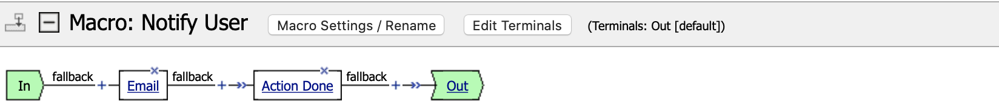
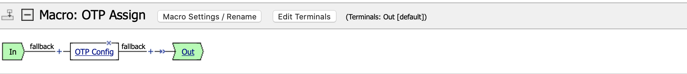
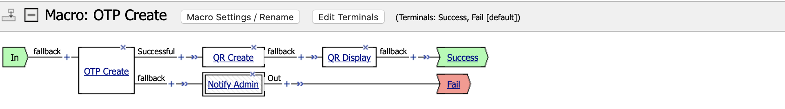
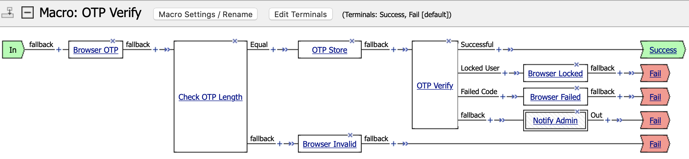

# Policy Description

## Contents

- [Overview](#overview)
- [Policy](#policy)
- [Macro](#macro)
  - [AD Modify](#ad-modify)
  - [AD Verify](#ad-verify)
  - [Notify Admin](#notify-admin)
  - [Notify User](#notify-user)
  - [OTP Assign](#otp-assign)
  - [OTP Create](#otp-create)
  - [OTP Verify](#otp-verify)

---

## Overview

This is a description of each element in Visual Policy Editor (VPE) which need to be created and configured in order to establish One-Time Password (OTP) configuration portal APM policy. To fill all VPE fields properly you have to obtain all external objects that are mentioned in [Installation Guide](./INSTALL.md).


## Policy


**Endings**  
Name = `Redirect`  
Type = Redirect [default]  
Color = #3  
Url = `https://otp.contoso.com/`  
Close session after redirect = Enabled  

**Need Update**  
Type = Decision Box  
Message = `One-Time Password (OTP) authentication token is already attached. Do you want to update it?`  
Field 1 image = green icon  
Option 1 = `Continue`  
Field 2 image = red icon  
Option 2 = `Exit`  

**Browser Good**  
Type = Message Box  
Message = `One-Time Password (OTP) authentication token is already up-to-date`  
Link = `Exit`  

**Browser Missing**  
Type = Message Box  
Message = `One-Time Password (OTP) is enabled for your account but authentication token is missing. Please, click link below to attach new one`  
Link = `Attach Token`  

## Macro

Macro definitions are used to simplify overall policy perception.

### AD Modify


**Terminals**  
Name = `Success`  
Type = -  
Color = #1  
Name = `Fail`  
Type = default  
Color = #2  

**LDAP Config**  
Type = Variable Assign  
`session.custom.ldap.bind_scheme` = `return {ldap://}`  
`session.custom.ldap.bind_fqdn` = `return {corp.contoso.com}`  
`session.custom.ldap.bind_port` = `return {389}`  
`session.custom.ldap.bind_dn` = `return {CN=bigip2faldapuser,OU=Service Accounts,DC=corp,DC=contoso,DC=com}`  
`session.custom.ldap.bind_pwd` = `return {COMPLEX_2FA_PASSWORD_STRING}` [Secure]  
`session.custom.ldap.user_dn` = AAA dn  
`session.custom.ldap.user_attr` = `return {extensionAttribute2}`  
`session.custom.ldap.user_value` = `mcget -nocache {session.custom.otp.secret_value}`  

**LDAP Modify**  
Type = iRule Event  
ID = `ldap_modify`  
`Successful` = `expr {[mcget -nocache {session.custom.ldap.modify_result}] == 0}`  

### AD Verify


**Terminals**  
Name = `OTP Enabled`  
Type = -  
Color = #1  
Name = `OTP Missing`  
Type = -  
Color = #3  
Name = `Fail`  
Type = default  
Color = #2  

**Browser Logon**  
Type = Logon Page  
Split domain from full Username = Enabled  
Form Header Text = `One-Time Password (OTP) Configuration Portal`  

**AD Auth**  
Type = AD Auth  
Server = **/CONTOSO/ActiveDirectory_aaa**  

**AD Query**  
Type = AD Query  
Server = **/CONTOSO/ActiveDirectory_aaa**  
SearchFilter = `sAMAccountName=%{session.logon.last.username}`  
Fetch Nested Groups = Enabled  
Required Attributes: **dn**, **extensionAttribute2**, **mail**, **memberOf**, **sAMAccountName**  
memberOf and OTP = `expr {[mcget {session.ad.last.attr.memberOf}] contains "CN=OTP_Allow,OU=Service Groups,DC=corp,DC=contoso,DC=com" && [mcget {session.ad.last.attr.extensionAttribute2}] != ""}`  
memberOf = `expr {[mcget {session.ad.last.attr.memberOf}] contains "CN=OTP_Allow,OU=Service Groups,DC=corp,DC=contoso,DC=com"}`  

**Browser Deny**  
Type = Message Box  
Message = `You are not allowed to use this service. Please contact your system administrator`  
Link = `Exit`  

### Notify Admin


**Terminals**  
Name = `Out`  
Type = default  
Color = #1  

**Email**  
Type = Email  
SMTP Configuration = **/Common/CONTOSO-Authenticated_smtp**  
From = `bigipsmtpuser@contoso.com`  
To = `bigipadmins@contoso.com`  
Subject = `%{session.access.profile} Internal Error`  
Message =
```
Internal error occurred

Session ID: %{session.user.sessionid}

User DN: %{session.ad.last.attr.dn}
User Mail: %{session.ad.last.attr.mail}

User Agent: %{session.user.agent}
Platform: %{session.client.platform}
```

**Internal Error**  
Type = Message Box  
Message = `Internal error occurred. Please, try again later`  
Link = `Exit`  

### Notify User



**Terminals**  
Name = `Out`  
Type = default  
Color = #1  

**Email**  
Type = Email  
SMTP Configuration = **/Common/CONTOSO-Unauthenticated_smtp**  
From = `noreply@contoso.com`  
To = `%{session.ad.last.attr.mail}`  
Subject = `OTP Updated`  
Message = `One-Time Password (OTP) authentication token was successfully updated for session %{session.user.sessionid} from IP address %{session.user.clientip}`  

**Action Done**  
Type = Message Box  
Message = `One-Time Password (OTP) authentication token was successfully updated`  
Link = `Exit`  

### OTP Assign



**Terminals**  
Name = `Out`  
Type = default  
Color = #1  

**OTP Config**  
Type = Variable Assign  
`session.custom.otp.secret_value` = AAA extensionAttribute2  
`session.custom.otp.secret_keyfile` = `return {/CONTOSO/otpenc-key}`  
`session.custom.otp.secret_hmac` = `return {sha1}`  
`session.custom.otp.otp_numdig` = `return {6}`  
`session.custom.otp.timestep_value` = `return {30}`  
`session.custom.otp.timestep_num` = `return {1}`  
`session.custom.otp.user_name` = AAA sAMAccountName  
`session.custom.otp.user_mail` = AAA mail  
`session.custom.otp.security_attempt` = `return {3}`  
`session.custom.otp.security_period` = `return {60}`  
`session.custom.otp.security_delay` = `return {300}`  

### OTP Create



**Terminals**  
Name = `Success`  
Type = -  
Color = #1  
Name = `Fail`  
Type = default  
Color = #2  

**OTP Create**  
Type = iRule Event  
ID = `otp_create`  
`Successful` = `expr {[mcget -nocache {session.custom.otp.verify_result}] == 0}`  

**QR Create**  
Type = Variable Assign  
`session.custom.otp.qr_img` = Paste contents of [qrcode.tcl](../ifiles/qrcode.tcl) file  

**QR Display**  
Type = Message Box  
Message =
```
%{session.custom.otp.qr_img}
<p>Account: %{session.ad.last.attr.mail}</p>
<p>Secret: %{session.custom.otp.secret_value_dec}</p>
```
Link = `Verify`  

### OTP Verify



**Terminals**  
Name = `Success`  
Type = -  
Color = #1  
Name = `Fail`  
Type = default  
Color = #2  

**Browser OTP**  
Type = Logon Page  
Variable Type = text; Post Variable Name = `otp_value`; Session Variable Name = `otp_value`  
Variable Type = **none**; Post Variable Name = password; Session Variable Name = password  
Form Header Text = `Secure Logon`  
Logon Page Input Field #1 = `One-Time Password`  
Logon Button = `Submit`  

**Check OTP Length**  
Type = Empty  
`Equal` = `expr {[string length [mcget {session.logon.last.otp_value}]] == [mcget {session.custom.otp.otp_numdig}]}`  

**OTP Store**  
Type = Variable Assign  
`session.custom.otp.otp_value` = SESSION session.logon.last.otp_value  

**OTP Verify**  
Type = iRule Event  
ID = `otp_verify`  
`Successful` = `expr {[mcget -nocache {session.custom.otp.verify_result}] == 0}`  
`Locked User` = `expr {[mcget -nocache {session.custom.otp.verify_result}] == 2}`  
`Failed Code` = `expr {[mcget -nocache {session.custom.otp.verify_result}] == 3}`  

**Browser Locked**  
Type = Message Box  
Message = `User locked out for %{session.custom.otp.security_delay} seconds. Please, try again later`  
Link = `Exit`  

**Browser Failed**  
Type = Message Box  
Message = `Code verification failed. Please, try again later`  
Link = `Exit`  

**Browser Invalid**  
Type = Message Box  
Message = `Code must be exactly %{session.custom.otp.otp_numdig} symbols`  
Link = `Exit`  
