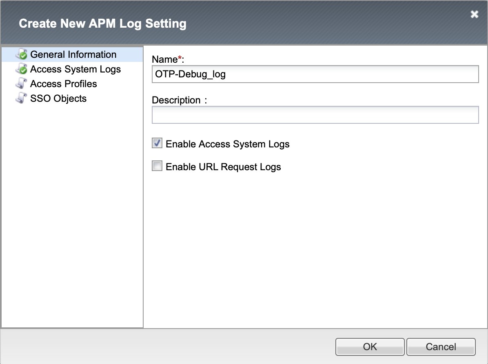
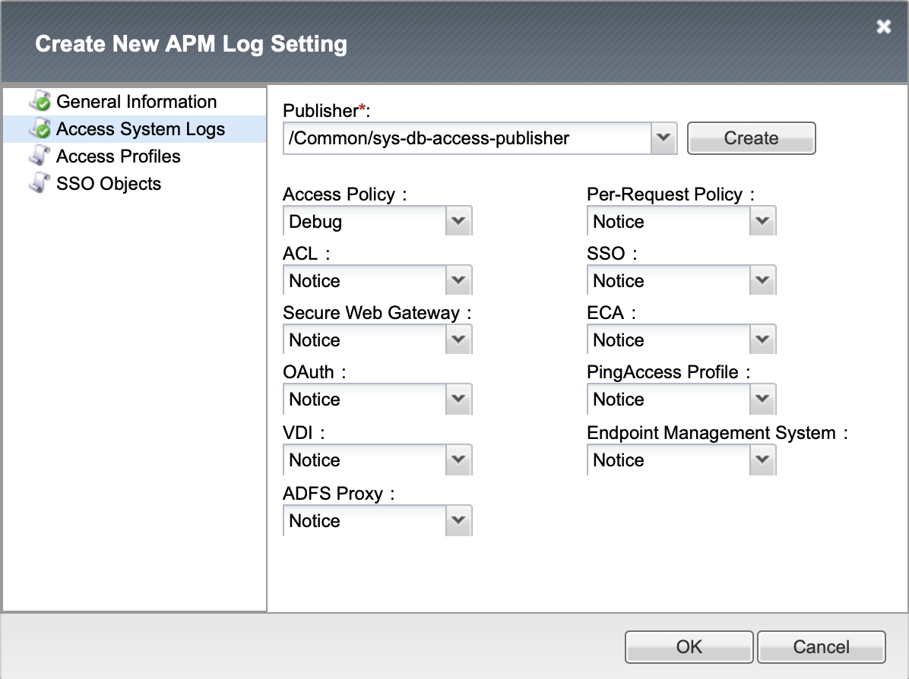

# Troubleshooting Guide

To troubleshoot this application there are two options which may be used in turn or simultaniously. First step is to enable debug logs for an APM policy and gathering facts form `/var/log/apm` file. Second step is to enabled debug logs for iRules and iRules LX from this application and gathering facts from `/var/log/ltm` file. You can compine those steps to take a full picture of what is going on.

---

## Contents

1. APM debug logs
2. iRules and iRules LX debug logs
   * OTP modification
   * OTP verification

## APM debug logs

APM debug logs allow you to troubleshoot user flow during policy evaluation in `/var/log/apm` file. In the end of troubleshooting process you need to restore log settings to previous state because log files may be fulfilled with unnecessary information.

**Enable debug logs**
1. Log in to BIG-IP GUI as a user with **Administrator** privileges
2. Select partition **CONTOSO** to enable APM debug logs
3. Go to *Access -> Overview -> Event Logs -> Settings*
4. Add new log setting with name **OTP-Debug_log**
5. Select **Enable Access System Logs**
6. Select **Debug** from **Access Policy**
7. Go to *Access -> Profiles / Policies -> Access Profiles (Per-Session Policies)*
8. Select APM policy that you want to debug. This may be **APM-OTP-Create_access** policy or your custom one
9. Detach all selected APM log settings (remember used settings)
10. Attach APM log setting with name **OTP-Debug_log**

**Disable debug logs**
1. Log in to BIG-IP GUI as a user with **Administrator** privileges
2. Select partition **CONTOSO** to enable APM debug logs
3. Go to *Access -> Profiles / Policies -> Access Profiles (Per-Session Policies)*
4. Select APM policy that you want to debug. This may be **APM-OTP-Create_access** policy or your custom one
5. Detach APM log setting with name **OTP-Debug_log**
6. Attach APM log settings that you remembered before
7. Go to *Access -> Overview -> Event Logs -> Settings*
8. Delete log setting with name **OTP-Debug_log**

## iRules and iRules LX debug logs

iRules and iRules LX debug logs allow you to troubleshoot data parsing processes inside iRules and iRules LX using `/var/log/ltm` file. In the end of troubleshooting process you need to restore log variables to disabled state because log files may contain sensitive user information.

### OTP modification

Use this section when you troubleshooting APM policy with name **/CONTOSO/APM-OTP-Create_access**.

**Enable debug logs**
1. Set varible `static::otp_create_debug` to **1** in file **/Common/APM-OTP-Create_irule**
2. Set varible `static::otp_verify_apm_debug` to **1** in file **/Common/APM-OTP-Verify_irule**
3. Set varible `static::ldap_modify_debug` to **1** in file **/Common/LDAP-Modify_plugin/APM-LDAP-Modify_irule**
4. Set varible `ldap_modify_debug` to **1** in file **/Common/LDAP-Modify_space/extensions/APM-LDAP-Modify_ilx/index.js**
5. Reload iRules LX plugin from Workspace

Example output from `/var/log/ltm`:
123

**Disable debug logs**
1. Set varible `static::otp_create_debug` to **0** in file **/Common/APM-OTP-Create_irule**
2. Set varible `static::otp_verify_apm_debug` to **0** in file **/Common/APM-OTP-Verify_irule**
3. Set varible `static::ldap_modify_debug` to **0** in file **/Common/LDAP-Modify_plugin/APM-LDAP-Modify_irule**
4. Set varible `ldap_modify_debug` to **0** in file **/Common/LDAP-Modify_space/extensions/APM-LDAP-Modify_ilx/index.js**
5. Reload iRules LX plugin from Workspace

### OTP verification

Use this section when you troubleshooting custom OTP enabled application.

**Enable debug logs**
1. Set varible `static::otp_verify_apm_debug` to **1** in file **/Common/APM-OTP-Verify_irule**
2. Set varible `static::otp_verify_ltm_debug` to **1** in file **/Common/LTM-OTP-Verify_irule**

Example output from `/var/log/ltm`:
123

**Disable debug logs**
1. Set varible `static::otp_verify_apm_debug` to **0** in file **/Common/APM-OTP-Verify_irule**
2. Set varible `static::otp_verify_ltm_debug` to **0** in file **/Common/LTM-OTP-Verify_irule**
